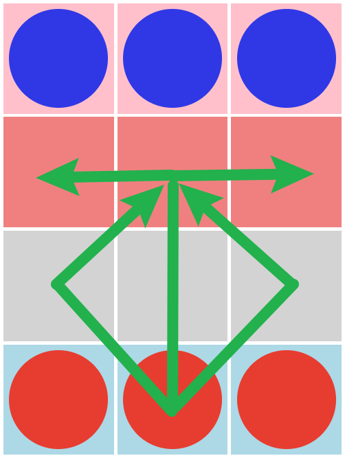
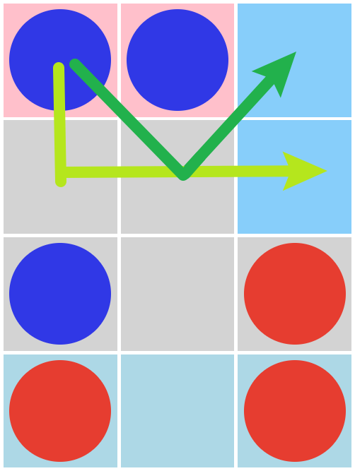

# BilliardsBoardGame
This is a JavaScript code to play a very unknown game called [Billiards](https://boardgamegeek.com/boardgame/32987/billiards).
You can play it [here](https://marcchacon.github.io/BilliardsBoardGame/)!

Thanks to @danielborowski for creating [jsboard](https://github.com/danielborowski/jsboard)!

## Rules
### Moves
You move in an L shaped path, diagonals allowed. It's mandatory to move at least one space on each part of the move and it must move. These images show examples of movement:

### Winning condition
You win by placing all your pieces to the other player's field (marked with your color)
## Custom CPU
With this CPU, you can change the parameters of the CPU at will! No limitation at all (careful as it can make your system run out of memory!) Here are the explanation of all parameters:
### Tree Depth
It's the depth of the [minimax](https://www.geeksforgeeks.org/minimax-algorithm-in-game-theory-set-1-introduction/) tree! It's not optimized, so careful with the high numbers!
### Lose Points
The points awarded to a losing board. It adds the depth so if all boards are a loss scenario it will try to go to the longest one.
### Win Points
The points awarded to a winning board. It subtracts the depth, so if it can choose between two winning scenarios, it will choose the quickest.
### CPU Blocking Points
The points awarded if any of the CPU pieces are blocking your winning spots. If it's blocking at least one spot, you won't be able to win!
### P1 Winning Points Multiplier
If the CPU is not blocking your winning spots, it will multiply this value on the number of pieces you have on your winning spots.
These points are subtracted! If you want to encourage the CPU to do this, set a negative value. 
### P1 No Blocking Points
The points awarded when you have no defense (no pieces on the CPU winning spots) 
## CPU vs CPU
In this gamemode you can see an automated version of the game! Edit the CPU via the custom cpu menu and enjoy! (Can cause Out of Memory errors in your browser if tree depth is set too high)
